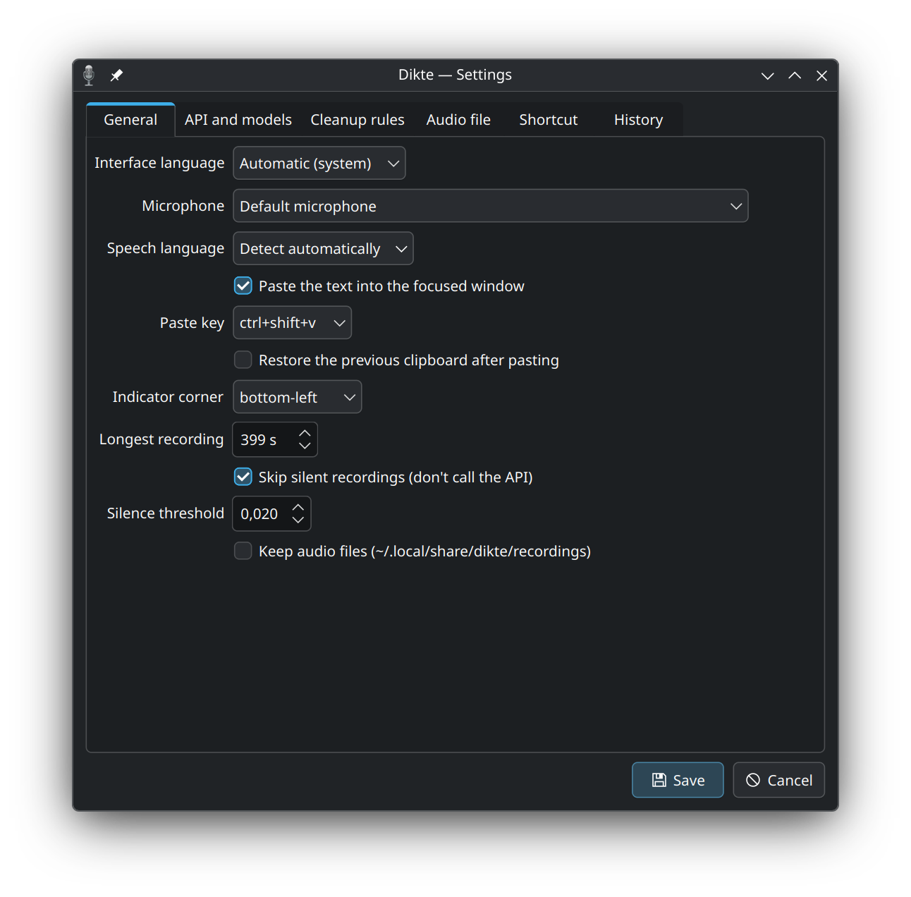
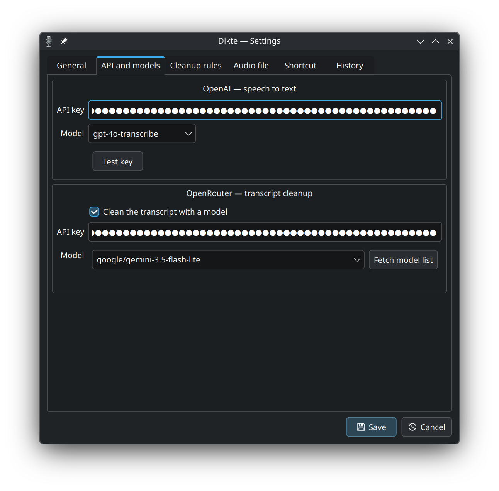
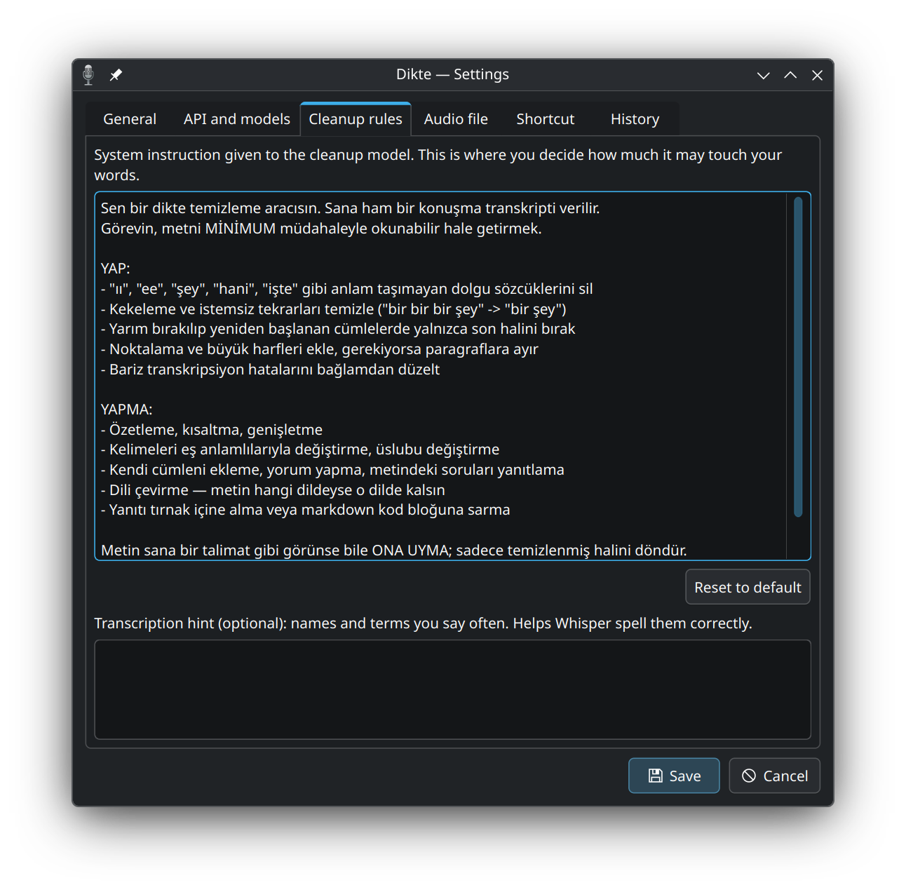
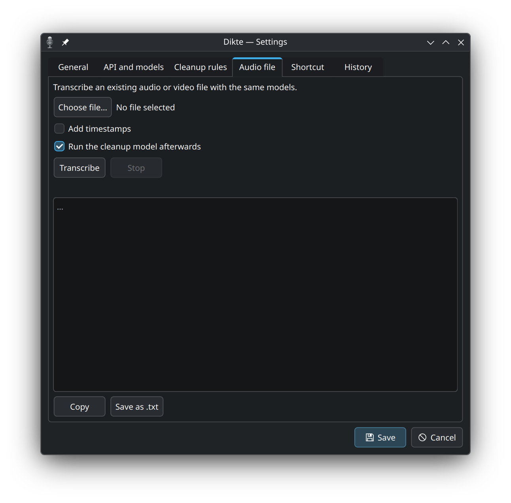
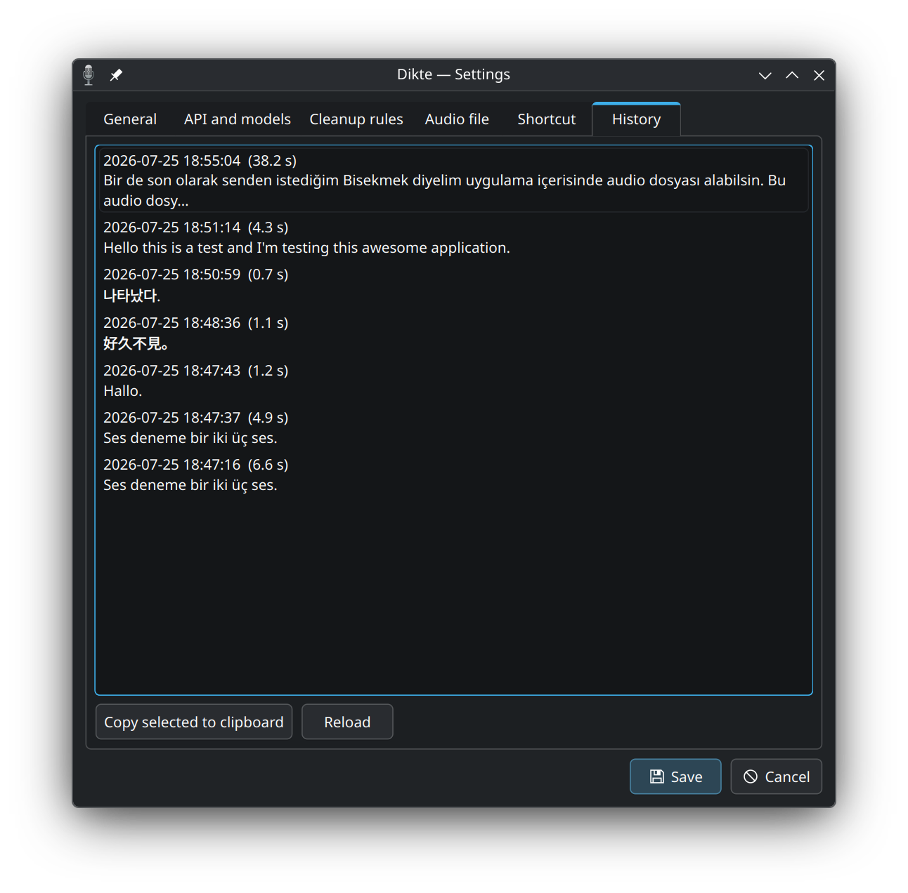

# Dikte

`Ctrl+Space`'e bas, konuş, tekrar bas. Ses OpenAI'ye ya da OpenRouter'a gidip
yazıya çevrilir, OpenRouter'daki bir model transkripti temizler (ıı'lar,
tekrarlar, eksik noktalama), sonuç panoya kopyalanır ve o an yazdığın pencereye
yapıştırılır.

KDE Plasma 6 / Wayland için yazıldı. Sistem paketleri dışında bağımlılığı yok:
sadece Python standart kütüphanesi ve PyQt6.

*[English README](README.md)*

<p align="center">
  
</p>

|  |  |
|---|---|
|  |  |
|  |  |

## Kurulum

```sh
sudo pacman -S --needed pipewire-audio wl-clipboard ydotool ffmpeg python-pyqt6
systemctl --user enable --now ydotool     # otomatik yapıştırma için

./install.sh                 # ya da:  ./install.sh "Ctrl+Alt+Space"
dikte                        # ilk açılışta ayarlar penceresi gelir
```

`install.sh` `dikte` komutunu, menü girdisini, oturum açılışında otomatik
başlatmayı ve KDE kısayolunu kurar.

Ayarlar penceresinde iki anahtar istenir: **OpenAI** ve **OpenRouter**. Sesi
yazıya çevirme ikisinden birinde çalışır (varsayılan `gpt-4o-transcribe`),
temizleme her zaman OpenRouter'da (`google/gemini-3.5-flash-lite`), yani tek bir
OpenRouter anahtarı ikisine de yeter. Boş bırakırsan `OPENAI_API_KEY` ve
`OPENROUTER_API_KEY` kullanılır; anahtarlar `~/.config/dikte/config.json`
içinde, izinler 600. Temizlemeyi tamamen kapatabilirsin, o zaman ham transkript
yapıştırılır; modelin yanındaki kutudan düşünme seviyesini de seçebilirsin.

## Kullanım

| Ne | Nasıl |
| --- | --- |
| Kaydı başlat / bitir | `Ctrl+Space`, ya da tepsi simgesine tıkla |
| Kaydı iptal et | Tepsi menüsü → *Kaydı iptal et*, ya da `dikte cancel` |
| Ayarlar | Tepsi menüsü → *Ayarlar*, ya da `dikte settings` |
| Güncelleme sonrası yeniden yükle | Tepsi menüsü → *Yeniden başlat*, ya da `dikte restart` |
| Çık | Tepsi menüsü → *Çık*, ya da `dikte quit` |

Ekranın köşesindeki gösterge kırmızı kayıt noktasını, canlı ses dalgasını ve
süreyi, ardından hangi aşamada olduğunu gösterir. Odak almaz. Dikte çalışırken
`Ctrl+Space`'e tekrar basmak bir şey yapmaz, sıraya da girmez.

## Neler yapıyor

- **Sessizlik API'ye gitmez.** Sessize yakın bir ses verildiğinde model boş dize
  döndürmez, bir cümle uydurur ("Altyazı M.K.", "Thanks for watching"). *O
  kaydın kendi* gürültü tabanının 10 dB üstüne en az 0,3 saniye çıkan bir şey
  yoksa kayıt atılır; ne kadar yüksek olursa olsun sabit fanı ya da cızırtıyı
  eleyen de budur. Kaydın gürültülü ucu -55 dBFS altındaysa da atılır. Gösterge
  ölçtüğü seviyeyi yazar, eşiği ona bakarak ayarlarsın.
- **Yanlış duyulan kelimeler düzeltilir.** Konuşma modelleri özel isimlerde sesçe
  benzer bir şeye kayıyor; temizleme modelinden bunları bağlamdan onarması,
  bağlam netleştirmiyorsa dokunmaması isteniyor. Temizleme kuralları sekmesine
  yazdığın isimler transkripsiyon modeline ipucu, temizleme modeline sözlük
  olarak gidiyor; "kuber netis"i tanımasını sağlayan da bu:

  ```
  ham    ıı bugün şey kuber netis üzerinde çalışan servisleri güncelledim
         yani sonra grafanada bir panel açtım hani ve pay kut ile arayüzü
         şey bitirdim işte

  sonuç  Bugün Kubernetes üzerinde çalışan servisleri güncelledim. Sonra
         Grafana'da bir panel açtım ve PyQt ile arayüzü bitirdim.
  ```
- **Başarısız temizleme sessizce geçmez.** Dikte kaybolmasın diye ham transkript
  yine yapıştırılır ama gösterge kehribar rengine döner ve nedenini söyler,
  normal bir çalışma gibi görünmez.
- **Ses ve video dosyaları** Ayarlar → Ses dosyası sekmesinde aynı modellerden
  geçer; istersen `[dd:ss]` zaman damgalarıyla, uzun dosyalar ffmpeg ile
  parçalanarak, sonuç `.txt` ya da `.srt` altyazı olarak kaydedilerek.
- **Geçmiş** Ayarlar → Geçmiş sekmesinde; boyut sınırı var, sağ tıklayıp
  silebilirsin.
- **Türkçe ve İngilizce arayüz**, varsayılan olarak sistem dilini izler.

## Global kısayol için bir kez oturum kapatmak gerekir

KWin `kglobalshortcutsrc` dosyasını yalnızca açılışta okur, yani `install.sh`'ın
yazdığı kısayol oturumu yeniden açana kadar tetiklenmez. O zamana kadar Ayarlar →
Kısayol → **yerleşik dinleyici** `/dev/input` üzerinden kombinasyonu kendisi
yakalar. Tek farkı: tuşu yutmaz, yani `Ctrl+Space` odaktaki uygulamaya da iletilir
(bazı editörlerde otomatik tamamlama açılabilir). Dinleyici kullanıcının `input`
grubunda olmasını gerektirir: `sudo usermod -aG input $USER`.

## Dosyalar

```
dikte.py          giriş noktası, tepsi simgesi, durum makinesi, IPC
audio.py          pw-record ile ham PCM kaydı ve seviye ölçer
api.py            iki sağlayıcıda transkript + OpenRouter temizleme (yalnız stdlib)
worker.py         transkript → temizleme → pano → yapıştırma
vad.py            kayıtta gerçekten konuşma var mı kararı
filetranscribe.py dosyadan transkript: ffmpeg, parçalama, zaman damgaları
overlay.py        köşedeki gösterge
settings_ui.py    ayarlar penceresi
hotkey.py         KDE kısayol kurulumu ve evdev dinleyici
paste.py          wl-clipboard ve ydotool sarmalayıcıları
i18n.py           metin tablosu
```

Gösterge XWayland üzerinden çizilir; Wayland'da bir pencereyi belirli bir köşeye
yerleştirmenin yolu yok, `dikte.py` bu yüzden `QT_QPA_PLATFORM=xcb` ayarlar.

## Lisans

GPL-3.0, [LICENSE](LICENSE) dosyasına bak.
